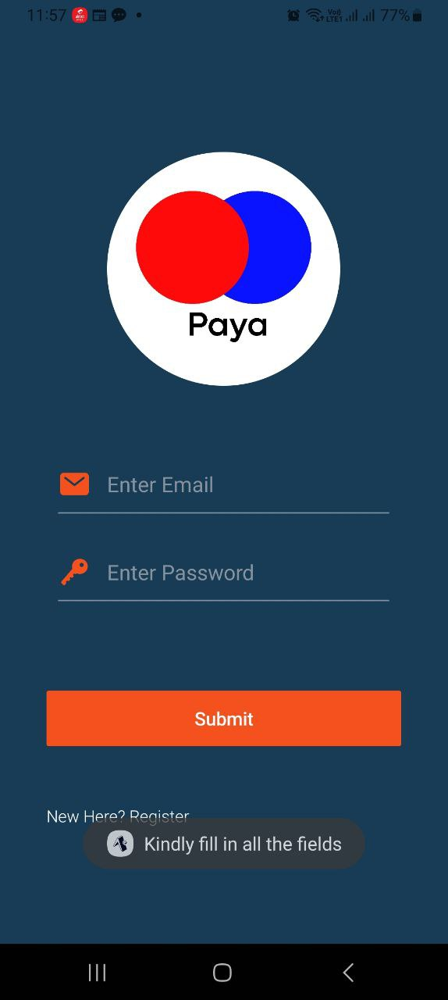

# PAYA TEST

### TECH STACK
- React Native 0.73.4
- Expo SDK ~50.0.8
- React Native Elements ^4.0.0-rc.7

### APK
-The apk is available [here](https://expo.dev/artifacts/eas/6KwvAiRFP8mpnNBST3epE7.apk)

### OVERVIEW
- A user Either Logs in or Registers before accessing the application. The user Data is validated with appropriate Errors thrown via the Native android Toast. Since the app does not call any API'S the app works perfectly offline.

- User data is stored in async storage, with appropriate reusable functionality for handling reads and writes.
-Once logged in, a user sees some Articles, which are seeded when the user instantiates the application for the first time, and persisted across restarts. The user can read these pre-existing ones, or create custom articles that are saved and persisted.

-Every article belongs to a category and users can filter by category in the articles screen.

### ROUTING

-Routing is handled elegantly by expo-router 3, enabling seamless navuigation through the screens.

## SCREENSHOTS

